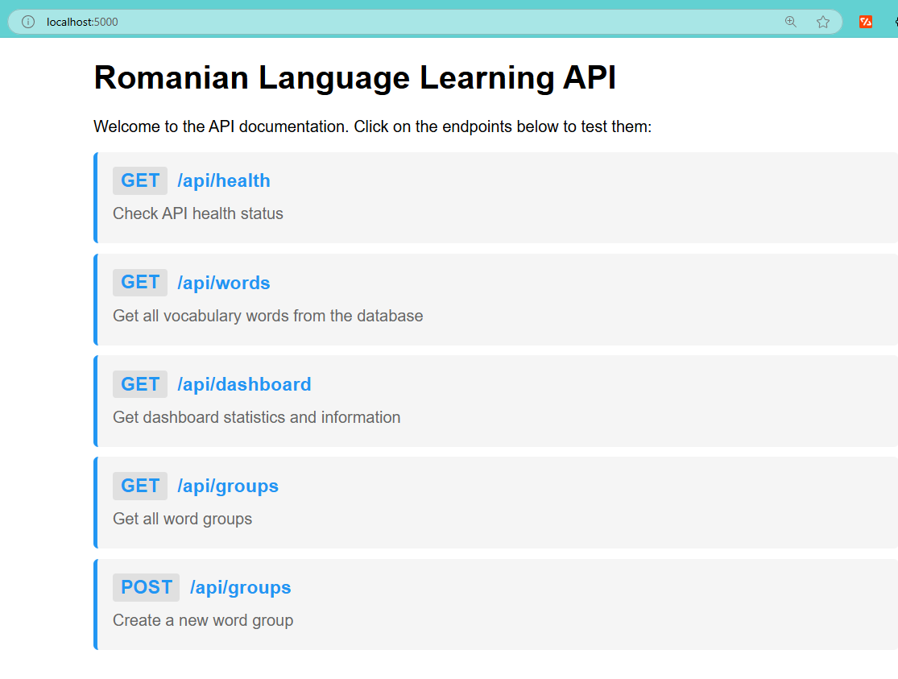
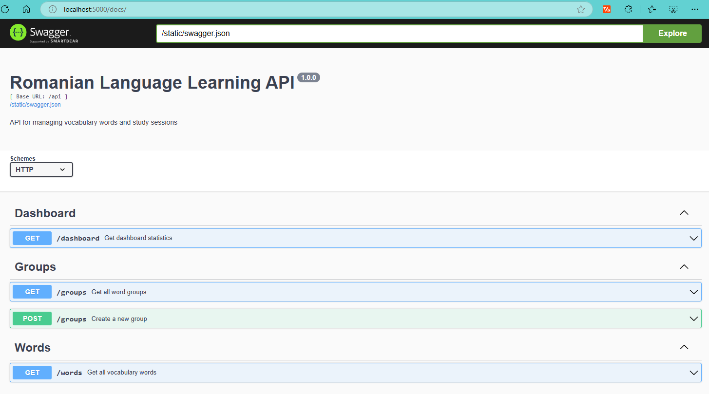
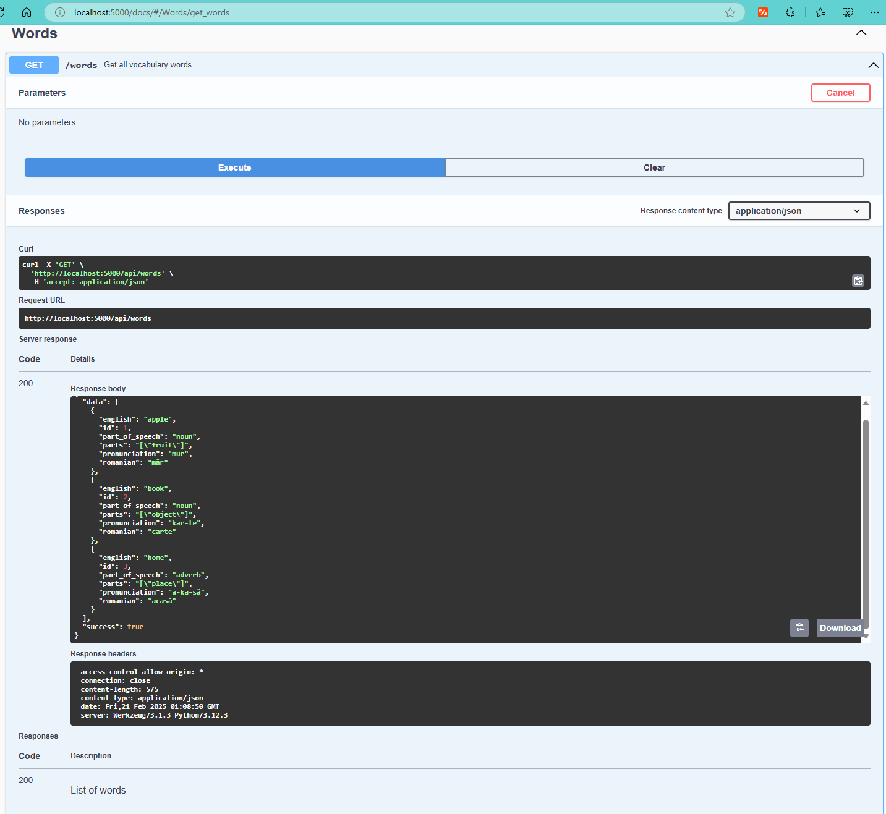

# Romanian Learning API - Backend

Flask API for managing Romanian vocabulary words, study sessions, and learning activities.

## Quick Start

### Requirements
- Python 3.12+
- Poetry

### Setup
```bash
# Install dependencies
poetry install

# Start virtual environment
poetry shell

# Initialize database
poetry run invoke init-db
poetry run invoke migrate
poetry run invoke seed

# Start server
poetry run python app.py
```

The API will run at `http://localhost:5000`

## Project Structure
```
backend-flask/
├── app/                    # Main application package
│   ├── __init__.py        # App initialization, routes, CORS
│   ├── config.py          # Environment & app settings
│   ├── models.py          # Database models
│   ├── middleware.py      # Error handling, auth
│   ├── swagger.py         # API documentation config
│   ├── templates/         # HTML templates
│   │   ├── api_docs.html  # API documentation page
│   │   ├── base.html     # Base template
│   │   ├── endpoint_docs.html  # Endpoint details
│   │   └── swagger_ui.html     # Swagger interface
│   ├── static/           # Static files
│   │   └── swagger.json  # OpenAPI specification
│   ├── routes/          # API endpoints
│   │   ├── __init__.py
│   │   ├── dashboard.py # Learning stats
│   │   ├── words.py     # Vocabulary management
│   │   └── groups.py    # Word categories
│   └── utils/           # Helper functions
│       ├── __init__.py
│       ├── database.py  # DB operations
│       └── validators.py # Input validation
├── tests/               # Test suite
│   ├── conftest.py     # Test configuration
│   ├── test_api.py     # API integration tests
│   ├── test_db.py      # Database tests
│   ├── models/         # Model tests
│   └── routes/         # Route tests
├── migrations/         # Database migrations
├── seeds/             # Sample data
├── pyproject.toml     # Poetry dependencies
├── poetry.lock        # Locked dependencies
└── README.md         # Documentation
```

Each directory serves a specific purpose:
- `app/`: Core application code
- `templates/`: HTML views for API documentation
- `static/`: API specification and assets
- `routes/`: API endpoint implementations
- `utils/`: Shared helper functions
- `tests/`: Comprehensive test suite
- `migrations/`: Database schema changes
- `seeds/`: Initial data for development

## API Endpoints

### Dashboard


```bash
GET /api/dashboard
# Returns learning statistics
```

### Words

```bash
GET /api/words
# Returns vocabulary list
```

### Groups

```bash
GET /api/groups
# Returns word categories

POST /api/groups
# Creates new category
```

## Data Models

### Word
```python
@dataclass
class Word:
    id: int
    romanian: str
    english: str
    pronunciation: str
    part_of_speech: str
    parts: List[str]
    created_at: datetime
    updated_at: datetime
```

### Group
```python
@dataclass
class Group:
    id: int
    name: str
    description: Optional[str]
    word_count: int
    created_at: datetime
    updated_at: datetime
```

## Testing

```bash
# Install test packages
poetry add pytest pytest-cov --group dev

# Run all tests
poetry run pytest

# Run with coverage
poetry run pytest --cov=app tests/

# Run specific tests
poetry run pytest tests/models/  # Only models
poetry run pytest tests/routes/  # Only routes
```

## API Documentation
- Swagger UI at `/docs`
- Interactive API testing
- Request/response examples
- Schema documentation

## Frontend Integration
- CORS enabled for frontend
- JSON responses match frontend needs
- Health checks at `/api/health`

## Contributing
1. Create feature branch
2. Make changes
3. Run tests
4. Submit pull request
