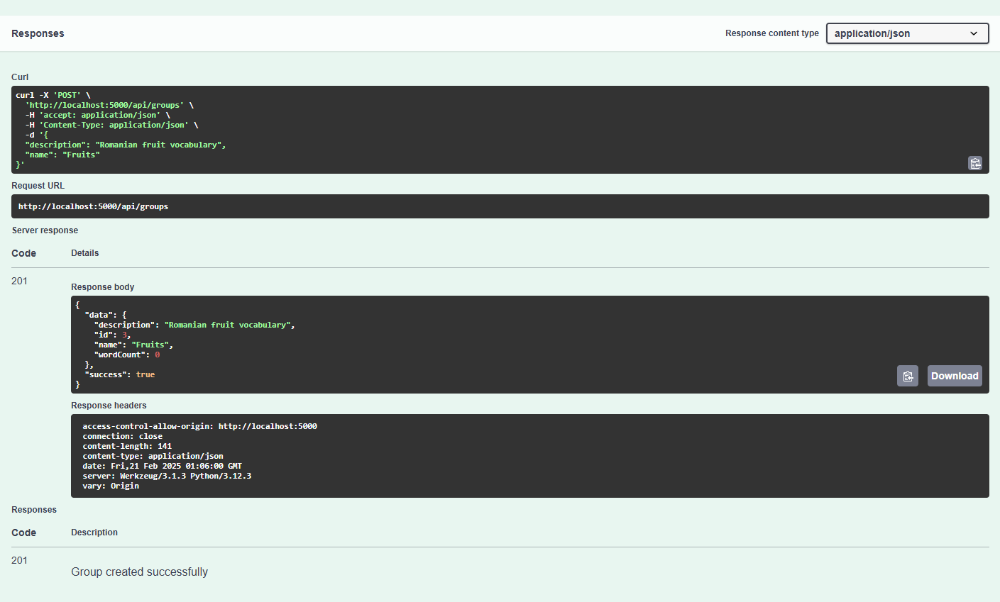

# Romanian Learning App - Backend 🔧

Flask API for managing Romanian vocabulary words, study sessions, and learning activities.

## Quick Start 🚀

```bash
# Start everything
docker compose up

# Just backend
docker compose up backend
```

## What It Does 🎯

- Stores your words
- Manages learning progress
- Handles file imports
- Talks to AI services

## API Routes 🛣️

| What It Does      | Route           | Method |
|------------------|-----------------|--------|
| Health check     | /health         | GET    |
| Get words        | /api/words      | GET    |
| Add words        | /api/words      | POST   |
| Import vocab     | /api/vocabulary | POST   |

## Testing 🧪

```bash
# Run tests
poetry run pytest

# Test coverage
poetry run pytest --cov
```

## Watching Metrics 📊

1. Open Grafana: http://localhost:3000
2. Login: admin/admin
3. Look for:
   - Request rates
   - Response times
   - Error rates

## API Documentation

### API Overview


### Detailed Endpoints

#### Dashboard API

```bash
GET /api/dashboard
# Returns learning statistics
```

#### Words API

```bash
GET /api/words
# Returns vocabulary list

GET /api/words/<id>
# Returns specific word details
```

#### Groups API

```bash
GET /api/groups
# Returns word categories

POST /api/groups
# Creates new category
```

## Project Structure
```
backend-flask/
├── app/                    # Main application package
│   ├── __init__.py        # App initialization, routes, CORS
│   ├── config.py          # Environment & app settings
│   ├── models.py          # Database models
│   ├── middleware.py      # Error handling, auth
│   ├── swagger.py         # API documentation config
│   ├── templates/         # HTML templates
│   │   ├── api_docs.html  # API documentation page
│   │   ├── base.html     # Base template
│   │   ├── endpoint_docs.html  # Endpoint details
│   │   └── swagger_ui.html     # Swagger interface
│   ├── static/           # Static files
│   │   └── swagger.json  # OpenAPI specification
│   ├── routes/          # API endpoints
│   │   ├── __init__.py
│   │   ├── dashboard.py # Learning stats
│   │   ├── words.py     # Vocabulary management
│   │   └── groups.py    # Word categories
│   └── utils/           # Helper functions
│       ├── __init__.py
│       ├── database.py  # DB operations
│       └── validators.py # Input validation
├── tests/               # Test suite
│   ├── conftest.py     # Test configuration
│   ├── test_api.py     # API integration tests
│   ├── test_db.py      # Database tests
│   ├── models/         # Model tests
│   └── routes/         # Route tests
├── migrations/         # Database migrations
├── seeds/             # Sample data
├── docs/              # Documentation
│   └── images/        # API documentation images
├── pyproject.toml     # Poetry dependencies
├── poetry.lock        # Locked dependencies
└── README.md         # Documentation
```

Each directory serves a specific purpose:
- `app/`: Core application code
- `templates/`: HTML views for API documentation
- `static/`: API specification and assets
- `routes/`: API endpoint implementations
- `utils/`: Shared helper functions
- `tests/`: Comprehensive test suite
- `migrations/`: Database schema changes
- `seeds/`: Initial data for development

## API Endpoints

### Dashboard


```bash
GET /api/dashboard
# Returns learning statistics
```

### Words

```bash
GET /api/words
# Returns vocabulary list
```

### Groups

```bash
GET /api/groups
# Returns word categories

POST /api/groups
# Creates new category
```

## Data Models

### Word
```python
@dataclass
class Word:
    id: int
    romanian: str
    english: str
    pronunciation: str
    part_of_speech: str
    parts: List[str]
    created_at: datetime
    updated_at: datetime
```

### Group
```python
@dataclass
class Group:
    id: int
    name: str
    description: Optional[str]
    word_count: int
    created_at: datetime
    updated_at: datetime
```

## Frontend Integration
- CORS enabled for frontend
- JSON responses match frontend needs
- Health checks at `/api/health`

## Contributing
1. Create feature branch
2. Make changes
3. Run tests
4. Submit pull request
