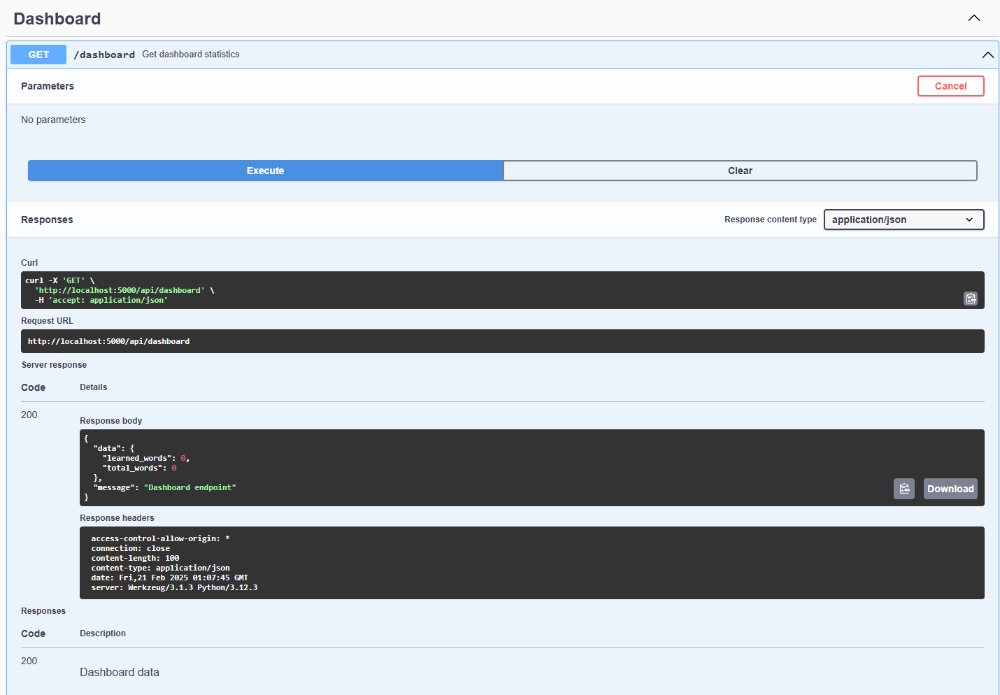

# Romanian Learning App - Backend 🔧

Flask API for managing Romanian vocabulary words, study sessions, and learning activities with AI-powered content generation and safety guardrails.

## Quick Start 🚀

```bash
# Start everything
docker compose up

# Just backend
docker compose up backend
```

## What It Does 🎯

- Stores your vocabulary words and groups
- Manages learning progress and statistics
- Handles file imports and exports
- Integrates with AI services for content generation
- Implements guardrails for content safety and quality

## API Routes 🛣️

| What It Does      | Route           | Method |
|------------------|-----------------|--------|
| Health check     | /api/health     | GET    |
| Get words        | /api/words      | GET    |
| Add words        | /api/words      | POST   |
| Import vocab     | /api/vocabulary | POST   |
| Get groups       | /api/groups     | GET    |
| Create group     | /api/groups     | POST   |
| Dashboard stats  | /api/dashboard  | GET    |

## Testing 🧪

```bash
# Run tests
poetry run pytest

# Test coverage
poetry run pytest --cov
```

## Guardrails System 🛡️

The application implements a comprehensive guardrails system to ensure content safety and quality:

### Input Validation

- Filters inappropriate content from user inputs
- Prevents prompt injection attacks
- Validates request parameters and data formats

### Output Processing

- Ensures proper Romanian diacritics usage
- Maintains formal language when appropriate
- Sanitizes AI-generated content before returning to users

### Implementation

```python
# Example of guardrails in action
@app.route('/api/vocabulary', methods=['POST'])
@guardrails_middleware
def generate_vocabulary():
    # Input is automatically validated by middleware
    # Output is processed before being returned
    result = openai_service.generate_vocabulary(request.json)
    return jsonify({"success": True, "data": result})
```

### Testing Guardrails

```bash
# Run guardrails-specific tests
poetry run pytest tests/utils/test_guardrails.py tests/utils/test_middleware.py tests/utils/test_guardrails_integration.py -v
```

## Watching Metrics 📊

1. Open Grafana: http://localhost:3000
2. Login: admin/admin
3. Look for:
   - Request rates
   - Response times
   - Error rates
   - Guardrails rejection metrics

## API Documentation

### API Overview


### Detailed Endpoints

#### Dashboard API

```bash
GET /api/dashboard
# Returns learning statistics
```

#### Words API

```bash
GET /api/words
# Returns vocabulary list

GET /api/words/<id>
# Returns specific word details
```

#### Groups API

```bash
GET /api/groups
# Returns word categories

POST /api/groups
# Creates new category
```

#### Vocabulary Generation API
```bash
POST /api/vocabulary
# Generates vocabulary with AI
# Protected by guardrails
```

## Project Structure
```
backend-flask/
├── app/                    # Main application package
│   ├── __init__.py        # App initialization, routes, CORS
│   ├── config.py          # Environment & app settings
│   ├── extensions.py      # Flask extensions (db, etc.)
│   ├── swagger.py         # API documentation config
│   ├── models/            # Database models
│   │   ├── __init__.py
│   │   ├── word.py        # Word model
│   │   ├── group.py       # Group model
│   │   └── word_group.py  # Association model
│   ├── routes/            # API endpoints
│   │   ├── __init__.py
│   │   ├── dashboard.py   # Learning stats
│   │   ├── words.py       # Vocabulary management
│   │   ├── groups.py      # Word categories
│   │   └── vocabulary.py  # AI vocabulary generation
│   ├── services/          # Business logic
│   │   ├── __init__.py
│   │   └── openai_service.py # AI integration
│   └── utils/             # Helper functions
│       ├── __init__.py
│       ├── guardrails.py  # Content safety system
│       ├── langchain_guardrails.py # LangChain integration
│       ├── middleware.py  # Request/response processing
│       └── validators.py  # Input validation
├── tests/                 # Test suite
│   ├── conftest.py        # Test configuration
│   ├── test_api.py        # API integration tests
│   ├── test_db.py         # Database tests
│   ├── models/            # Model tests
│   ├── routes/            # Route tests
│   ├── services/          # Service tests
│   └── utils/             # Utility tests including guardrails
├── pyproject.toml         # Poetry dependencies
├── poetry.lock            # Locked dependencies
└── README.md              # Documentation
```

Each directory serves a specific purpose:
- `app/`: Core application code
- `models/`: Database schema definitions
- `routes/`: API endpoint implementations
- `services/`: Business logic and external integrations
- `utils/`: Shared helper functions including guardrails
- `tests/`: Comprehensive test suite

## Data Models

### Word
```python
class Word(db.Model):
    id: int
    romanian: str
    english: str
    pronunciation: str
    part_of_speech: str
    parts: List[str]
    created_at: datetime
    updated_at: datetime
```

### Group
```python
class Group(db.Model):
    id: int
    name: str
    description: Optional[str]
    word_count: int
    created_at: datetime
    updated_at: datetime
```

## Guardrails Architecture

The guardrails system consists of several components:

1. **Input Validation**
   - Checks for inappropriate content
   - Validates request structure
   - Prevents prompt injection

2. **Output Processing**
   - Ensures proper Romanian diacritics
   - Maintains formal language when needed
   - Sanitizes AI-generated content

3. **Middleware Integration**
   - Automatically applies guardrails to routes
   - Provides consistent error handling
   - Logs guardrails activity

4. **LangChain Integration**
   - Uses LangChain for advanced content filtering
   - Implements custom chains for Romanian language

## Frontend Integration
- CORS enabled for frontend
- JSON responses match frontend needs
- Health checks at `/api/health`
- Standardized response format: `{"success": bool, "data": any}`

## Contributing
1. Create feature branch
2. Make changes
3. Run tests
4. Submit pull request
