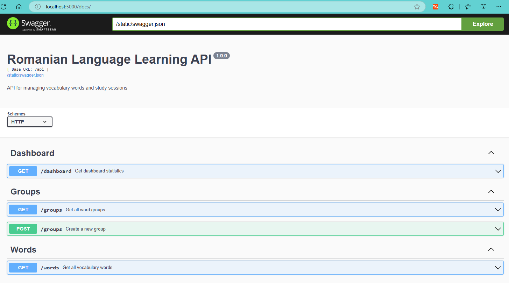
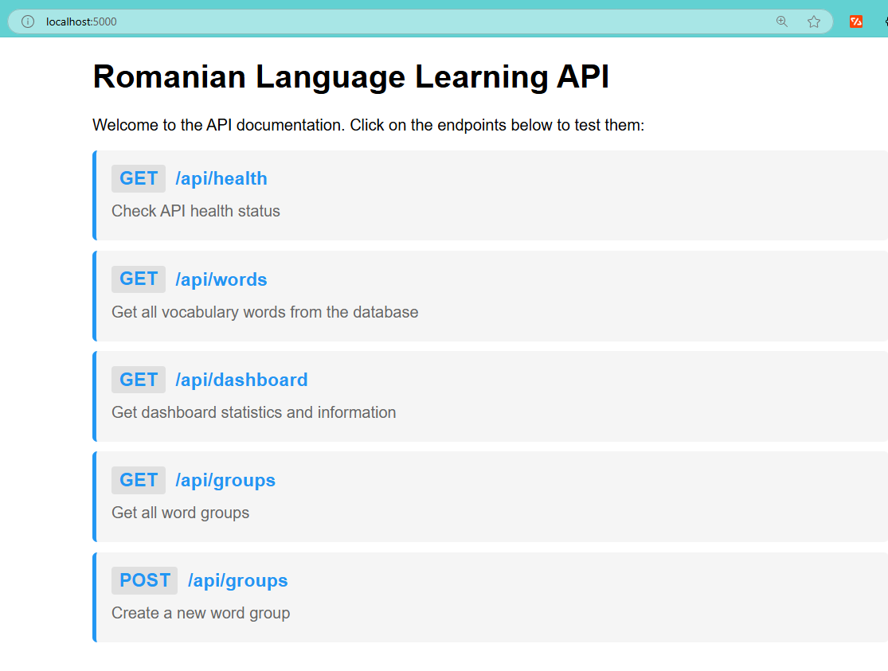
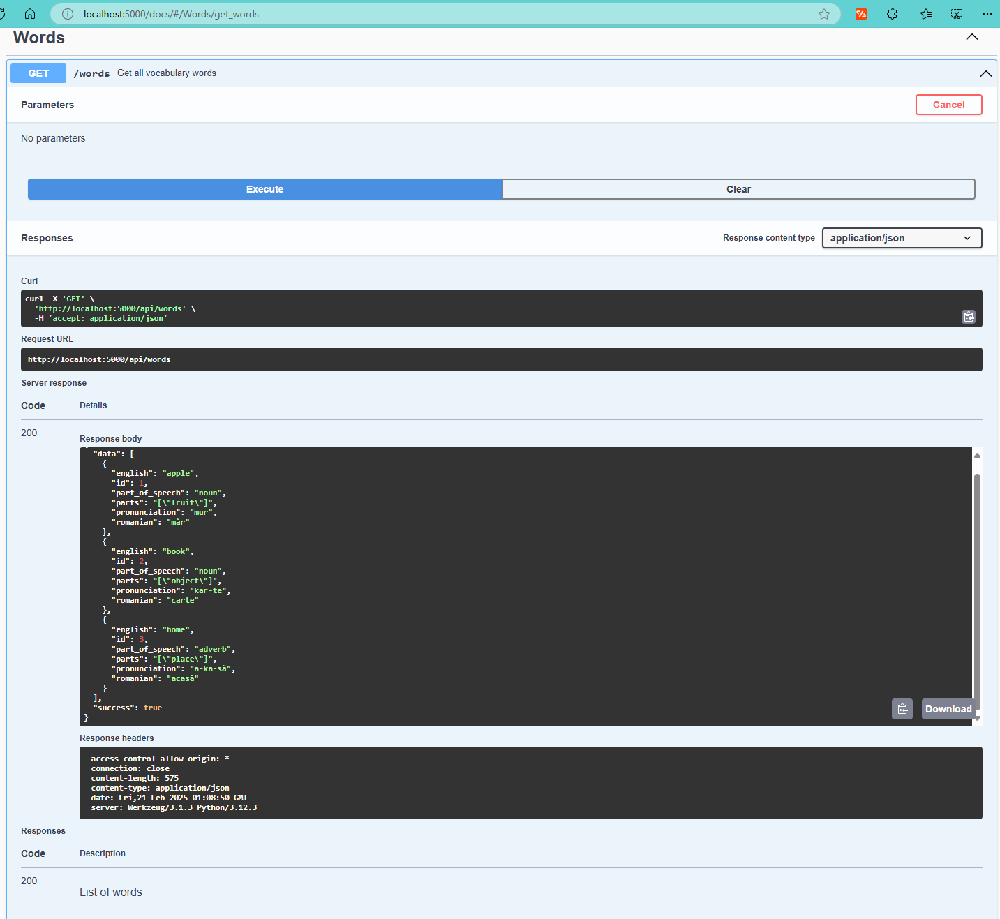
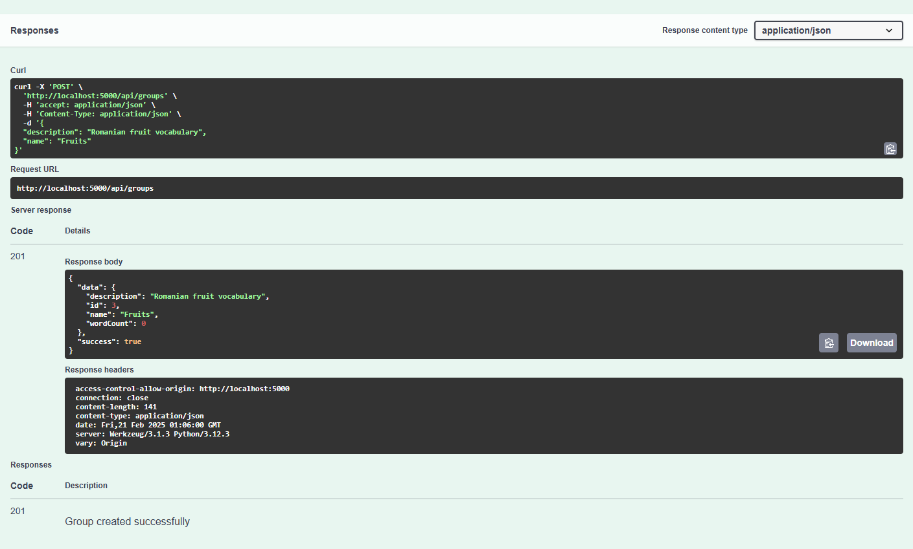
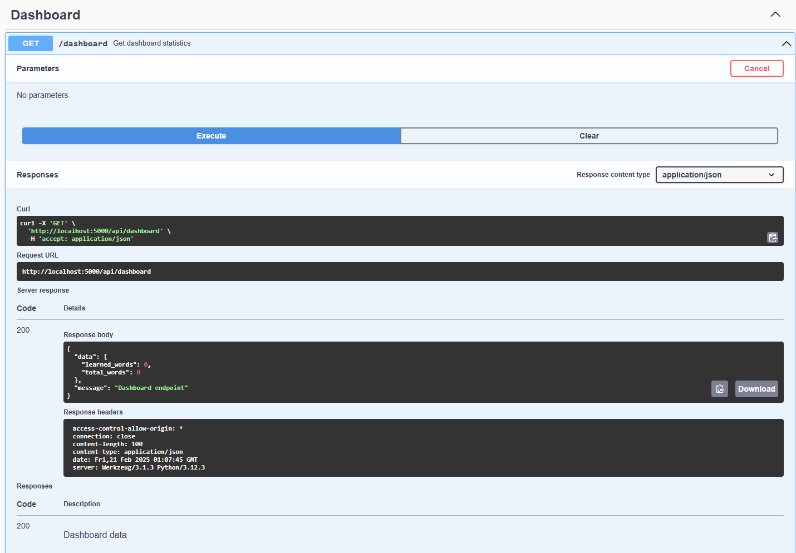
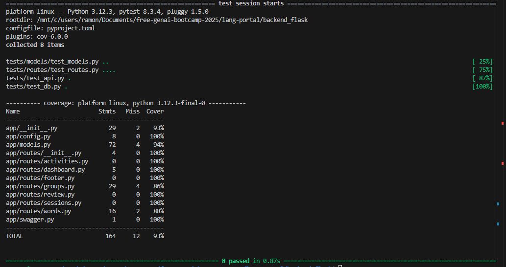

# Romanian Language Learning Portal - Backend

This is the Flask backend for the Romanian Language Learning Portal. It provides the API endpoints for managing vocabulary words, study sessions, and learning activities.

## Table of Contents
- [Setup](#setup)
  - [Prerequisites](#prerequisites)
  - [Installation](#installation)
- [Database Setup](#database-setup)
- [Project Structure](#project-structure)
- [Available Routes](#available-routes)
  - [Dashboard](#dashboard)
  - [Words](#words)
  - [Groups](#groups)
- [Data Models](#data-models)
  - [Word](#word)
  - [Group](#group)
  - [WordGroup](#wordgroup-relationship)
- [Testing the API](#testing-the-api)
  - [Using Swagger UI](#using-swagger-ui-recommended)
  - [Using curl](#using-curl)
- [Frontend Integration](#frontend-integration)
- [Development](#development)
- [Contributing](#contributing)
- [API Documentation Screenshots](#api-documentation-screenshots)
- [Testing](#testing)
  - [Running Tests](#running-tests)
  - [Test Structure](#test-structure)
  - [What's Being Tested](#whats-being-tested)
  - [Test Coverage](#test-coverage)

## Setup

### Prerequisites
- Python 3.12+
- Poetry (Python package manager)

### Installation

1. Clone the repository:
```bash
git clone <repository-url>
cd lang-portal/backend_flask
```

2. Install dependencies using Poetry:
```bash
poetry install
```

3. Activate the virtual environment:
```bash
poetry shell
```

[↑ Back to top](#table-of-contents)

## Database Setup


The application uses SQLite for data storage. Follow these steps to set up the database:

1. Initialize the database:
```bash
poetry run invoke init-db
```
This will create a new SQLite database file (`words.db`) and enable foreign key support.

2. Run database migrations:
```bash
poetry run invoke migrate
```
This will create all necessary tables defined in the `migrations` folder.

3. Seed the database with initial data:
```bash
poetry run invoke seed
```
This will populate the database with sample words, groups, and relationships from the `seeds` folder.

[↑ Back to top](#table-of-contents)

## Project Structure

```
backend_flask/
├── app/                    # Application package
│   ├── __init__.py        # App initialization and routes
│   ├── config.py          # Configuration settings
│   ├── models.py          # Database models (dataclasses)
│   ├── swagger.py         # Swagger/OpenAPI specifications
│   ├── routes/            # API endpoints
│   │   ├── __init__.py
│   │   ├── dashboard.py   # Dashboard statistics
│   │   ├── words.py       # Vocabulary management
│   │   └── groups.py      # Word groups/categories
│   └── utils/             # Helper functions
├── migrations/            # Database migrations
├── seeds/                # Seed data
├── tasks.py             # Invoke tasks
└── README.md           # This file
```

[↑ Back to top](#table-of-contents)

## Available Routes

### Dashboard
- `GET /api/dashboard`
  - Returns learning statistics
  - Used by: Dashboard component in frontend

### Words
- `GET /api/words`
  - Returns all vocabulary words
  - Used by: Word list and study components

### Groups
- `GET /api/groups`
  - Returns all word groups
  - Used by: GroupsTable component
- `POST /api/groups`
  - Creates a new word group
  - Used by: CreateGroupDialog component

[↑ Back to top](#table-of-contents)

## Data Models
```
### Word
```python
@dataclass
class Word:
    id: int
    romanian: str
    english: str
    pronunciation: str
    part_of_speech: str
    parts: List[str]
    created_at: datetime
    updated_at: datetime
```

### Group
```python
@dataclass
class Group:
    id: int
    name: str
    description: Optional[str]
    word_count: int
    created_at: datetime
    updated_at: datetime
```

### WordGroup (Relationship)
```python
@dataclass
class WordGroup:
    id: int
    word_id: int
    group_id: int
```

[↑ Back to top](#table-of-contents)


## Testing the API
```

### Using Swagger UI (Recommended)
1. Start the server:
```bash
poetry run python app.py
```

2. Visit http://localhost:5000/docs
3. Use the interactive Swagger UI to:
   - View all available endpoints
   - Test GET and POST requests
   - See request/response schemas
   - Try out the API with example data

### Using curl
```bash
# Test root endpoint
curl http://localhost:5000/

# Test health check
curl http://localhost:5000/api/health

# Get all words
curl http://localhost:5000/api/words

# Get all groups
curl http://localhost:5000/api/groups

# Create a new group
curl -X POST http://localhost:5000/api/groups \
  -H "Content-Type: application/json" \
  -d '{"name": "Test Group", "description": "Test Description"}'
```

[↑ Back to top](#table-of-contents)

## Frontend Integration

```

The backend serves the React frontend through these key integrations:

1. CORS Support
   - Enabled for frontend development
   - Allows requests from React development server

2. API Endpoints
   - Match frontend component needs
   - Return JSON data in expected formats
   - Handle frontend state management requirements

3. Data Flow
   - Frontend components -> API requests -> Backend routes
   - Database operations -> JSON responses -> Frontend state

4. Example Integration:
```typescript
// Frontend component making API call
const fetchWords = async () => {
  const response = await fetch('http://localhost:5000/api/words');
  const data = await response.json();
  setWords(data.data);
};
```

## Development
[↑ Back to top](#table-of-contents)


1. Start the development server:
```bash
poetry run python app.py
```

2. The API will be available at `http://localhost:5000`
3. Swagger UI documentation at `http://localhost:5000/docs`


[↑ Back to top](#table-of-contents)

## Contributing

1. Create a new branch for your feature
2. Make your changes
3. Run tests to ensure everything works
4. Submit a pull request

## API Documentation Screenshots
[↑ Back to top](#table-of-contents)

### Swagger UI Interface

*Interactive API documentation with Swagger UI*

### API Endpoints

*Available API endpoints on the home page*

### Example Responses

#### Words Endpoint

*Response from GET /api/words showing vocabulary items*

#### Groups Endpoint

*Response from GET /api/groups showing word categories*

#### Dashboard Statistics

*Response from GET /api/dashboard showing learning progress*

## Testing
[↑ Back to top](#table-of-contents)

### Running Tests

1. Install test dependencies:
```bash
poetry add pytest pytest-cov --group dev
```

2. Run all tests:
```bash
poetry run pytest
```

3. Run tests with coverage report:
```bash
poetry run pytest --cov=app tests/
```

4. Run specific test categories:
```bash
# Test models only
poetry run pytest tests/models/test_models.py

# Test routes only
poetry run pytest tests/routes/test_routes.py

# Test with verbose output
poetry run pytest -v
```

### Test Structure

```
tests/
├── __init__.py
├── conftest.py           # Test configuration and fixtures
├── test_api.py          # API integration tests
├── test_db.py           # Database tests
├── models/
│   └── test_models.py   # Model unit tests
└── routes/
    └── test_routes.py   # Route tests
```

### What's Being Tested

1. Models (`test_models.py`):
   - Word model creation and validation
   - Group model creation and validation
   - Data type conversions
   - DateTime handling
   ```python
   def test_word_from_db_row():
       row = (1, "măr", "apple", "mur", "noun", '["fruit"]', "2024-03-20T10:00:00", "2024-03-20T10:00:00")
       word = Word.from_db_row(row)
       assert word.romanian == "măr"
   ```

2. Routes (`test_routes.py`):
   - Health check endpoint (`/api/health/`)
   - Words endpoint (`/api/words/`)
   - Groups endpoints (`/api/groups/`)
   - Response formats and status codes
   ```python
   def test_create_group(client):
       group_data = {
           'name': 'Test Group',
           'description': 'Test Description'
       }
       response = client.post('/api/groups/', json=group_data)
       assert response.status_code == 201
   ```

3. API Integration (`test_api.py`):
   - Dashboard statistics
   - Error handling
   - Response structure

4. Database (`test_db.py`):
   - Connection handling
   - Migration testing
   - Data persistence

### Test Coverage

Current test coverage (run `poetry run pytest --cov=app tests/`):


*Detailed test coverage report showing 93% coverage across all modules*

[↑ Back to top](#table-of-contents)
