# Frontend Technical Specifications

## Table of Contents
1. [Overview](#overview)
2. [Core Pages & API Requirements](#core-pages--api-requirements)
   - [Dashboard](#1-dashboard-dashboard)
   - [Word Groups](#2-word-groups-groups)
   - [Word Collection](#3-word-collection-words)
   - [Study Activities](#4-study-activities-study-activities)
   - [Learning Sessions](#5-learning-sessions-sessions)
   - [Settings](#6-settings-settings)
3. [Footer Pages](#footer-pages)
4. [Error Handling](#error-handling)
5. [Authentication Requirements](#authentication-requirements)
6. [Data Models](#data-models)
7. [Footer Requirements](#footer-requirements)
8. [Technical Notes](#technical-notes)

[↑ Back to Top](#table-of-contents)
## Overview

The frontend is built using:
- React + Vite
- TypeScript
- Tailwind CSS
- shadcn/ui components
- React Router for routing
- i18next for translations
- React Query for data fetching
- Error handling system with toast notifications

## Core Pages & API Requirements

### 1. Dashboard (`/dashboard`)

#### Purpose
The main landing page, providing an overview of progress and quick access to key features.

#### Key Components
- **Last Study Session**
  - Details of most recent activity
  - Date, score, duration
  
- **Study Progress**
  - Total words learned
  - Completion rates
  - Learning streaks
  
- **Quick Stats**
  - Total words in collection
  - Number of word groups
  - Completed study sessions

#### Required API Endpoints
```typescript
// Get dashboard overview
GET /api/dashboard
Response {
  lastSession: {
    date: string
    score: number
    duration: number
    activity: string
  }
  progress: {
    totalWordsLearned: number
    completionRate: number
    streak: number
  }
  stats: {
    totalWords: number
    totalGroups: number
    completedSessions: number
  }
}
```

#### Page Preview
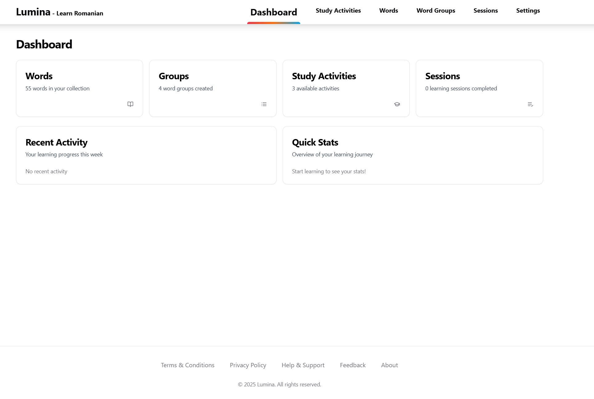
- Overview cards showing learning progress
- Quick stats and achievements
- Start studying button for quick access

### 2. Word Groups (`/groups`)

#### Purpose
Organize vocabulary into themed collections.

#### Components
- Group creation dialog
- Groups table with sorting
- Practice button per group

#### Required API Endpoints
```typescript
// Get all groups
GET /api/groups
Response: WordGroup[] {
  id: number
  name: string
  description: string
  wordCount: number
}

// Create group
POST /api/groups
Body: {
  name: string
  description: string
}

// Update group
PUT /api/groups/:id
Body: {
  name: string
  description: string
}

// Delete group
DELETE /api/groups/:id

// Get words in group
GET /api/groups/:id/words
```

#### Page Previews
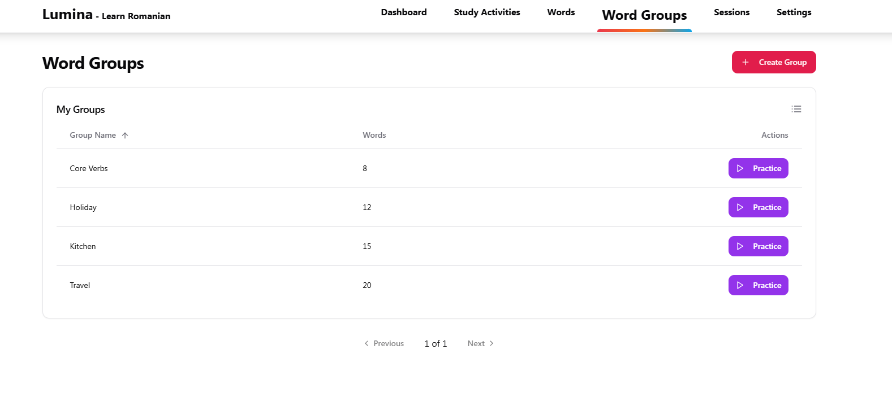
- Table view of all word groups
- Sorting and management controls

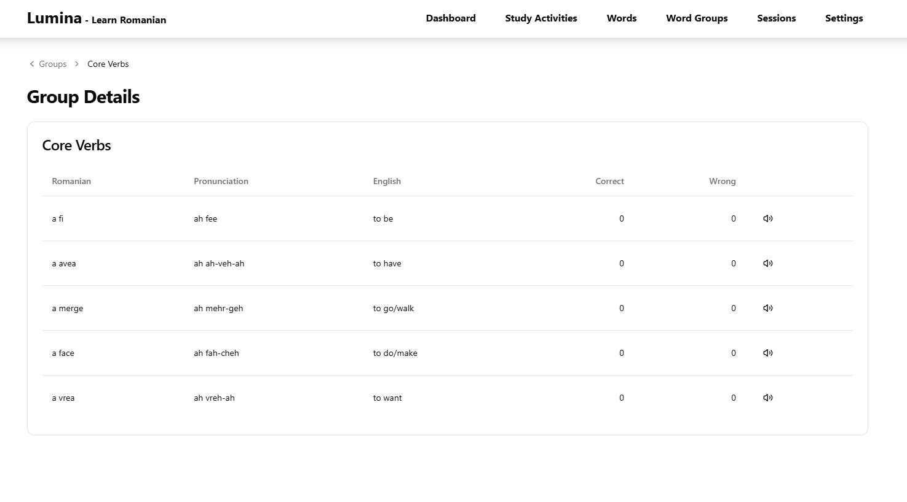
- Individual group view
- Word list within group
- Group management options

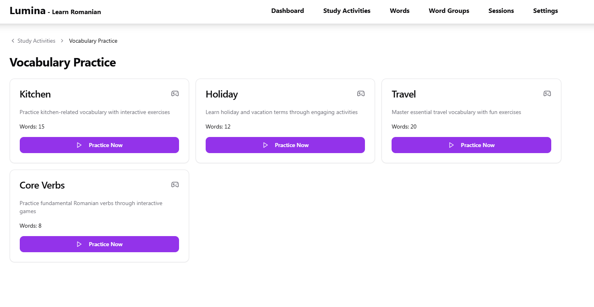
- Practice activities specific to group
- Progress tracking per group

### 3. Word Collection (`/words`)

#### Purpose
Manage personal vocabulary collection.

#### Components
- Search & filter functionality
- Word cards with:
  - Romanian term
  - Pronunciation
  - English definition
  - Part of speech
  - Practice button
  - Tags/labels

#### Required API Endpoints
```typescript
// Get all words
GET /api/words
Query params: {
  search?: string
  group?: number
  page?: number
  limit?: number
}
Response: {
  words: Word[]
  total: number
}

// Add word
POST /api/words
Body: {
  romanian: string
  english: string
  pronunciation?: string
  partOfSpeech: string
  groupIds?: number[]
}

// Update word
PUT /api/words/:id
Body: {
  romanian?: string
  english?: string
  pronunciation?: string
  partOfSpeech?: string
  groupIds?: number[]
}

// Delete word
DELETE /api/words/:id
```

#### Page Previews
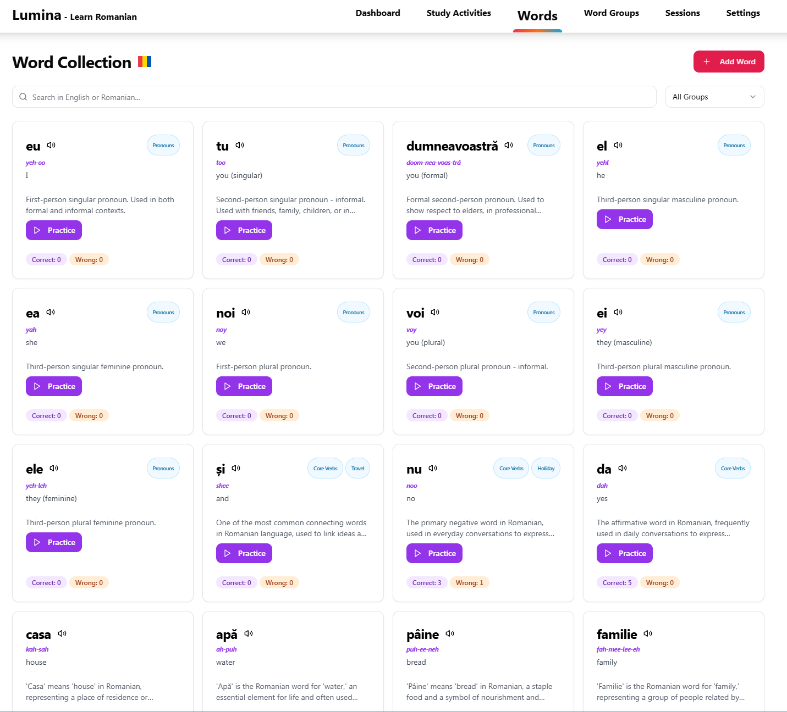
- Grid view of vocabulary cards
- Search and filter options

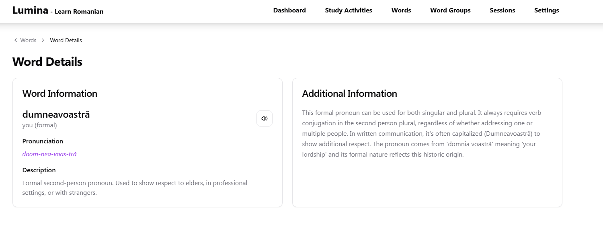
- Detailed word view
- Pronunciation guide
- Translation and usage examples

### 4. Study Activities (`/study-activities`)

#### Purpose
Access different learning exercises.

#### Components
- Activity cards for:
  - Vocabulary Practice
  - Reading Comprehension
  - Grammar Exercises
- Progress tracking

#### Required API Endpoints
```typescript
// Get available activities
GET /api/activities
Response: Activity[] {
  id: string
  type: 'vocabulary' | 'reading' | 'grammar'
  title: string
  description: string
  progress: number
}

// Start activity session
POST /api/activities/:id/start
Response: {
  sessionId: string
  questions: Question[]
}

// Submit activity results
POST /api/activities/:id/submit
Body: {
  sessionId: string
  answers: Answer[]
}
```

#### Page Previews
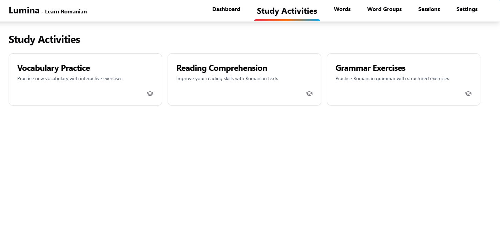
- Main activities dashboard

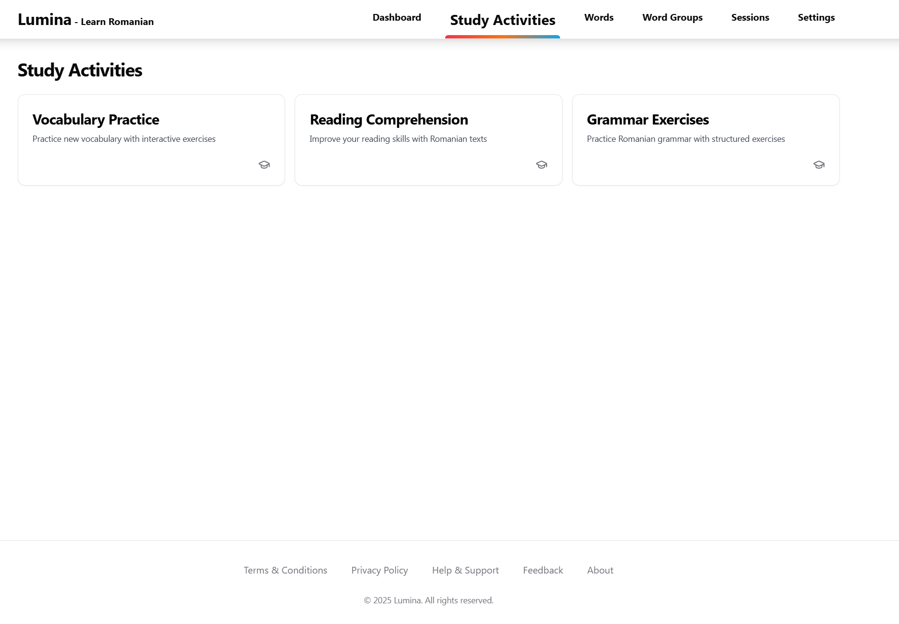
- Available learning exercises
- Progress indicators

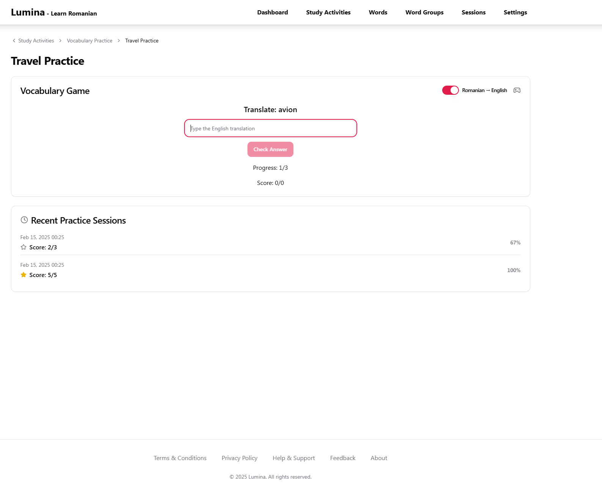
- Individual activity interface
- Interactive learning elements

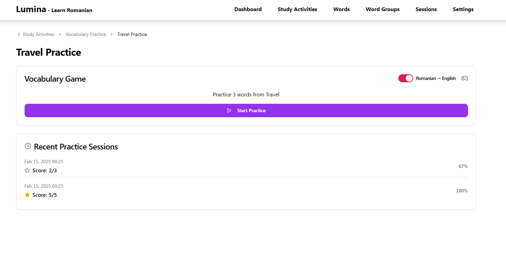
- Activity start screen
- Instructions and options

### 5. Learning Sessions (`/sessions`)

#### Purpose
Track study history and performance with detailed session information.

#### Components
- **Session List Table**
  - Paginated view of all study sessions
  - Columns:
    - Session ID (clickable, links to session detail)
    - Activity Name
    - Group Name
    - Start Time
    - End Time
    - Review Items Count
  - Sorting capabilities
  - Pagination controls
  
- **Session Details View** (`/sessions/:id`)
  - Performance breakdown
  - Review items list
  - Time spent statistics
  - Accuracy metrics

#### Required API Endpoints
```typescript
// Get paginated sessions list
GET /api/study_sessions
Query params: {
  page?: number
  limit?: number
  sortBy?: 'startTime' | 'endTime' | 'activityName' | 'groupName'
  sortOrder?: 'asc' | 'desc'
}
Response: {
  sessions: {
    id: string
    activityName: string
    groupName: string
    startTime: string
    endTime: string
    reviewItemsCount: number
    score: number
  }[]
  total: number
  currentPage: number
  totalPages: number
}

// Get session details
GET /api/study_sessions/:id
Response: {
  id: string
  activityName: string
  groupName: string
  startTime: string
  endTime: string
  score: number
  details: {
    correctAnswers: number
    totalQuestions: number
    timeSpent: number
    reviewItems: {
      id: number
      word: string
      correct: boolean
      userAnswer: string
      correctAnswer: string
    }[]
  }
}
```

#### Page Previews
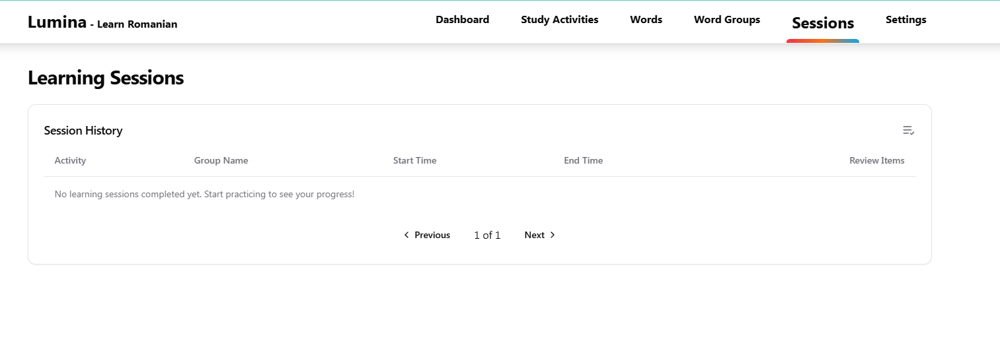
- Paginated session history table
- Sortable columns
- Quick access to session details
- Performance overview

### 6. Settings (`/settings`)

#### Page Preview
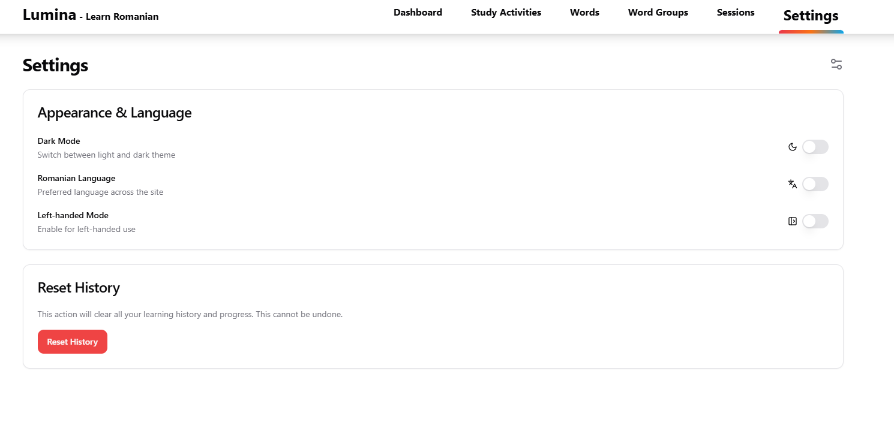
- User preferences
- Language options
- Theme selection
- Account settings

## Footer Pages

The footer provides access to important information pages:

#### Terms & Conditions
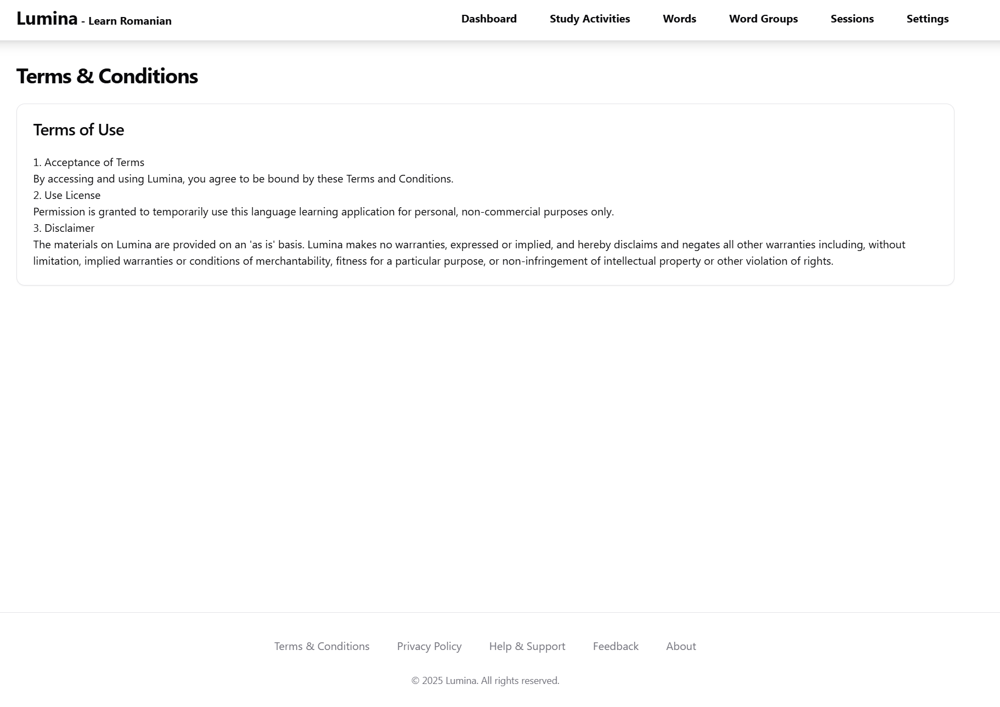
- User agreement
- Service terms
- Usage guidelines

#### Privacy Policy
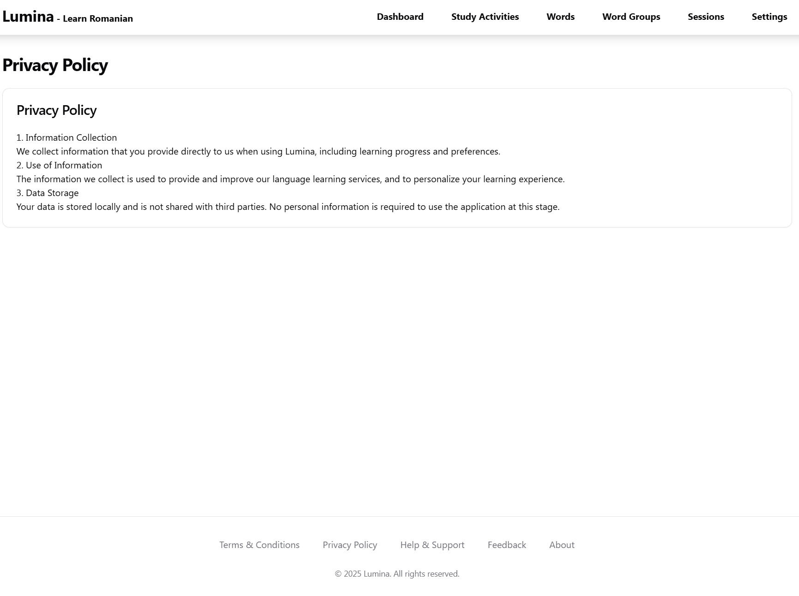
- Data handling policies
- User privacy information
- Cookie policies

#### Help & Support
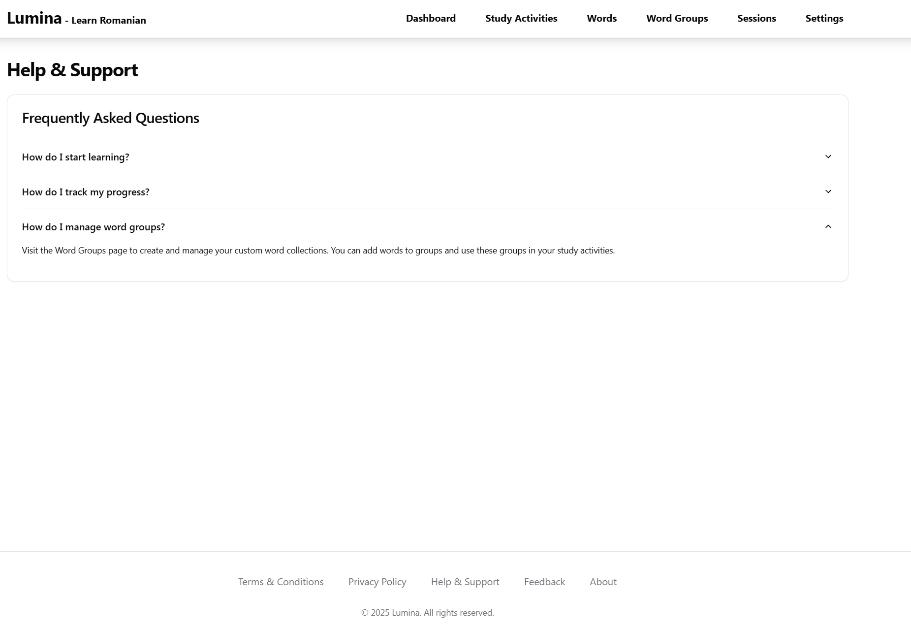
- User guides
- FAQs
- Contact support

#### Feedback
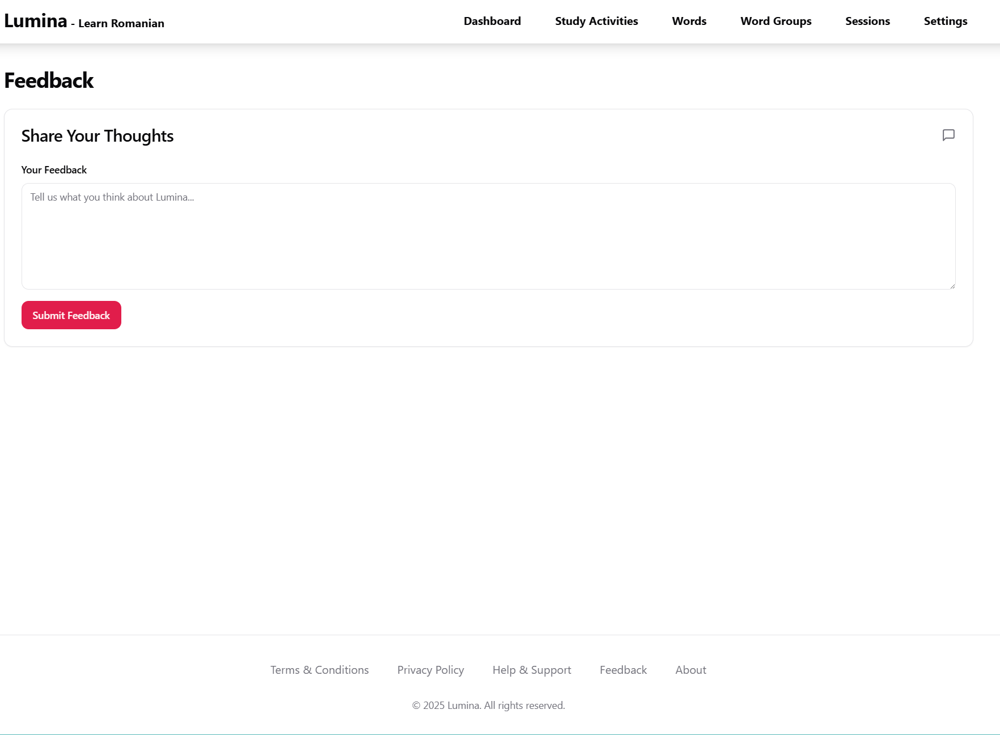
- User feedback form
- Suggestions
- Bug reporting

#### About
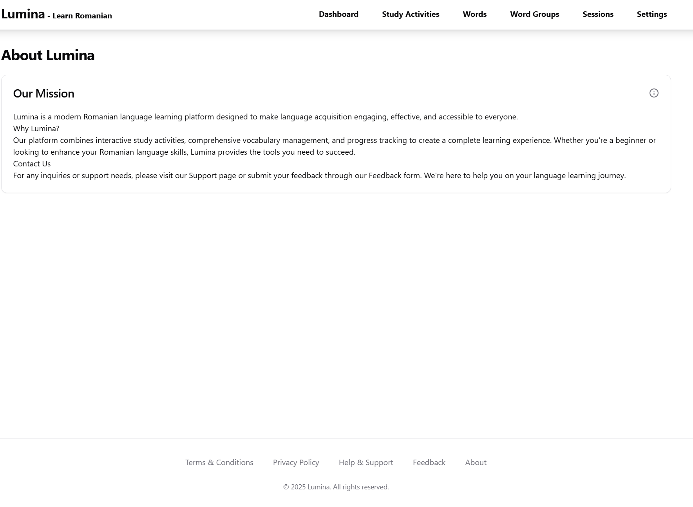
- App information
- Mission statement
- Team details

## Error Handling

The frontend implements a centralized error handling system that expects HTTP error responses in this format:

```typescript
{
  code: string       // Error code (e.g., 'VALIDATION_ERROR')
  message: string    // User-friendly message
  details?: {        // Optional error details
    field?: string
    value?: any
    [key: string]: any
  }
}
```

## Authentication Requirements

The backend should implement:
- JWT-based authentication
- Refresh token mechanism
- CSRF protection
- Rate limiting

## Data Models

The backend should support these core models:

```typescript
interface Word {
  id: number
  romanian: string
  english: string
  pronunciation?: string
  partOfSpeech: string
  createdAt: string
  updatedAt: string
  groupIds: number[]
}

interface WordGroup {
  id: number
  name: string
  description: string
  wordCount: number
  createdAt: string
  updatedAt: string
}

interface Session {
  id: string
  type: string
  startTime: string
  endTime: string
  score: number
  userId: number
  details: object
}
```

## Footer Requirements

The footer is present on all pages and contains:

#### Components
- Navigation links:
  - Terms & Conditions (`/terms`)
  - Privacy Policy (`/privacy`)
  - Help & Support (`/support`)
  - Feedback (`/feedback`)
  - About (`/about`)
- Copyright notice
- Social media links (optional)

#### Implementation
```typescript
interface FooterLink {
  href: string
  label: string
}

const footerLinks: FooterLink[] = [
  { href: '/terms', label: 'Terms & Conditions' },
  { href: '/privacy', label: 'Privacy Policy' },
  { href: '/support', label: 'Help & Support' },
  { href: '/feedback', label: 'Feedback' },
  { href: '/about', label: 'About' }
]
```

#### Required API Endpoints
```typescript
// Get footer content (optional, if dynamic)
GET /api/footer
Response: {
  links: FooterLink[]
  copyright: string
  socialLinks?: {
    platform: string
    url: string
    icon: string
  }[]
}
```

## Technical Notes

- Responsive design for all screen sizes
- Accessible following WCAG guidelines
- Supports offline functionality where possible
- Consistent footer present across all pages
- Responsive design adapting to screen sizes
- Accessible navigation links
